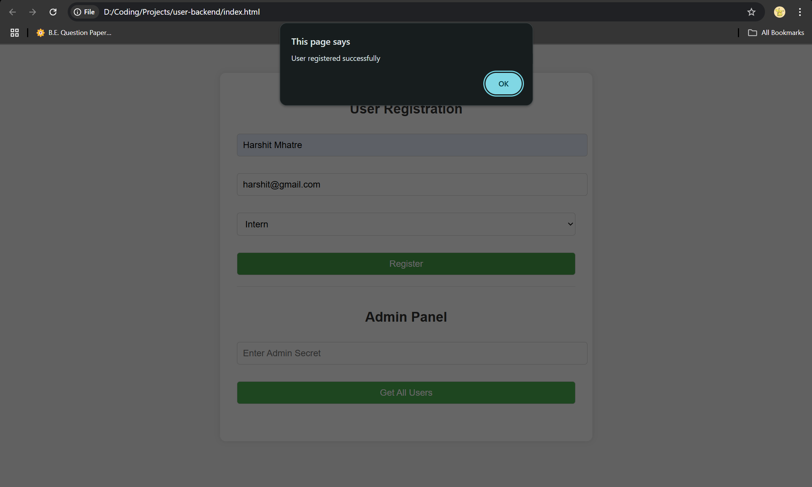
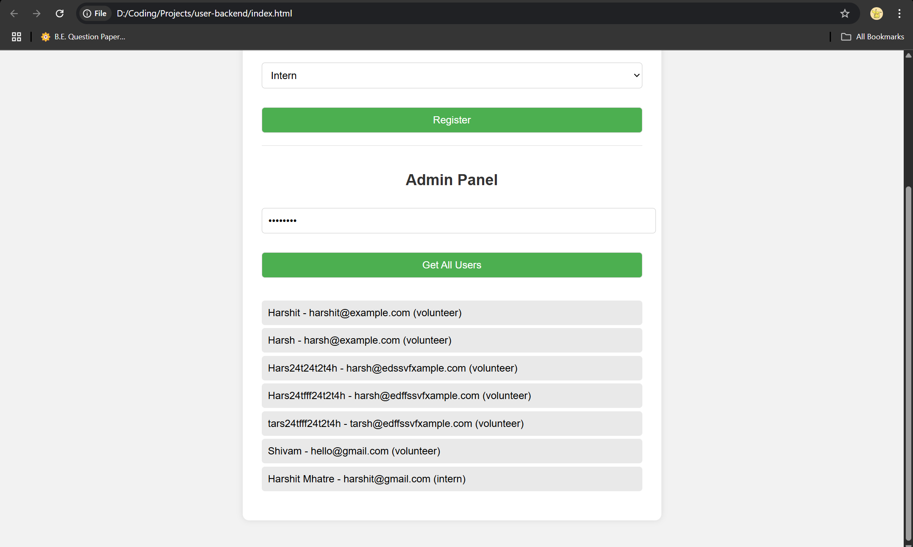
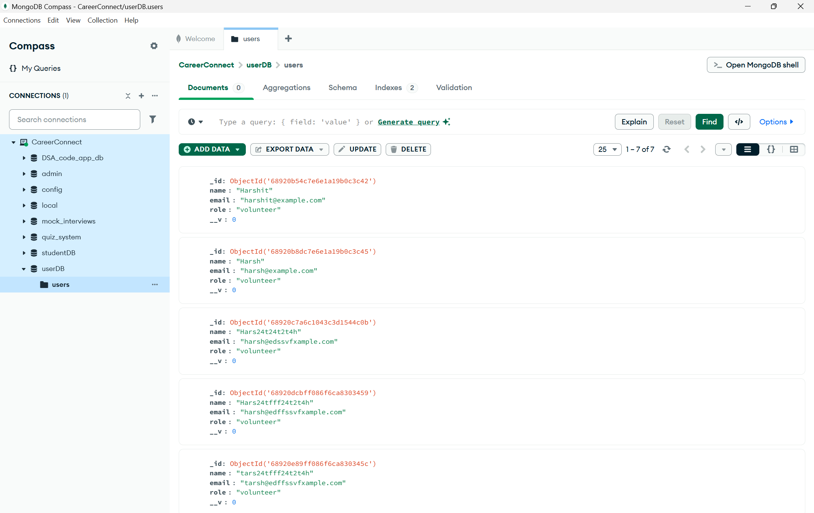

# 👤 User Registration Backend

A simple backend and frontend interface for registering users as **Volunteers** or **Interns**, with an admin panel to view all registered users.

---

## 🛠 Tech Stack

- **Backend:** Node.js, Express.js
- **Database:** MongoDB (with Mongoose)
- **Frontend:** HTML, CSS, Vanilla JavaScript
- **API Testing:** Postman
- **CORS:** Enabled (for local frontend access)

---

## ✨ Features

✅ Register users with **name**, **email**, and **role** (Intern or Volunteer)  
✅ **Admin-only** access to list all registered users  
✅ Admin access secured with a secret key  
✅ MongoDB storage using a Mongoose schema  
✅ User-friendly interface with a clean and simple UI

---

## 📸 Screenshots

### ✅ Successful Registration


### 🔐 Admin Panel Listing All Users


### 📂 MongoDB Entries via Compass


---

## 🚀 How to Run the Project

### 1. Clone the Repository
```bash
git clone https://github.com/your-username/user-backend.git
cd user-backend
```

### 2. Install Dependencies
```bash
npm install
```

### 3. Configure Environment Variables

Create a `.env` file in the root directory and add:

```env
PORT=5000
MONGODB_URI=mongodb://localhost:27017/userDB
ADMIN_SECRET=youradminsecret
```

### 4. Start MongoDB
Ensure MongoDB is running locally on your system.

### 5. Start the Backend Server
```bash
npm start
```

Server will run at: [http://localhost:5000](http://localhost:5000)

---

## 🌐 API Endpoints

| Method | Endpoint                           | Description                      |
|--------|------------------------------------|----------------------------------|
| POST   | `/api/users/register`              | Register a new user              |
| GET    | `/api/users/all?secret=ADMIN_SECRET` | Retrieve all users (Admin only) |

---

## 🧪 API Testing (Postman)

## 📬 How to Use Postman

### 🔹 1. Register a New User (POST)

**URL:**  
```
http://localhost:5000/api/users/register
```

**Method:** `POST`  
**Headers:**
```
Content-Type: application/json
```

**Body (raw → JSON):**
```json
{
  "name": "Harshit Mhatre",
  "email": "harshit@gmail.com",
  "role": "intern"
}
```

**Example Success Response:**
```json
{
  "message": "User registered successfully"
}
```

---

### 🔹 2. Get All Users (GET – Admin Only)

**URL:**  
```
http://localhost:5000/api/users/all?secret=youradminsecret
```

**Method:** `GET`

> Replace `youradminsecret` with the value you defined in your `.env` file.

**Example Success Response:**
```json
[
  {
    "_id": "64f03bd...",
    "name": "Harshit Mhatre",
    "email": "harshit@gmail.com",
    "role": "intern",
    "__v": 0
  },
  ...
]
```

## 🖥 Frontend Interface

Open the `index.html` file in your browser:

```bash
index.html
```

Make sure your backend server is running at `localhost:5000`.

---

## 📄 Task Summary

**Role:** Back-End Developer  
**Tech Used:** Node.js, Express.js, MongoDB  
**Responsibilities:**
- Implement backend API routes
- Set up MongoDB with Mongoose
- Create admin-protected route for user listing
- Build a clean frontend interface

**Deliverables:**
- ✅ GitHub Repository
- ✅ Postman Collection
- ✅ Working Frontend UI

---

## ✅ To-Do Enhancements

- [ ] Add input validation (e.g., email format, required fields)
- [ ] Deploy to cloud (e.g., Render, Railway, Vercel)
- [ ] Add password-based login for Admin
- [ ] Add pagination & search/sort in Admin view

> Made with ❤️ by **Harshit Mhatre**
